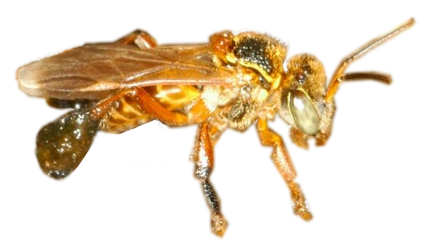

# *Frieseomelitta varia* genome assembly



## Illumina HiSeq2500 sequencing:

The DNA library preparation and sequenging steps were made at [LaCTAD](https://www.lactad.unicamp.br/) sequencing facility.
Details about Illumina sequenging strategies and the resulting data are described:

* TruSeq Paired-end 
	* ~350 bp - average insert size
	* 2 * 101 bp
	* 1 Lane
	* 1 Sample
	
	| Name   | Lane | Index  | Sample   | #Reads          | % Bases >= Q30 |
	| ------ | ---- | ------ | -------- | --------------- | -------------- |
	| DNAPE1 | L006 | CAGATC | Drone    | 2 * 120,948,424 | 64.85          |
	| DNAPE2 | L001 | ACAGTG | Drone    | 2 * 130,859,645 | 94.53          |

* Nextera Mate-pair
	* ~3 Kbp - average fragment size
	* 2 * 101 bp
	* 1 Lane
	* 1 Sample
	
	| Name        | Lane | Index   | Sample   | #Reads          | % Bases >= Q30 |
	| ----------- | -----| ------- | -------- | --------------- | -------------- |
	| DNAMatePair | L007 | NoIndex | Drone    | 2 * 85,513,161  | 92.10          |

> The sequencing step was performed by LaCTAD and the above information was provided by MSc. Osvaldo Reis Júnior (LaCTAD).

## Genome estimates 

The genome heterozygosity, repeat content, and size was evaluated from sequencing reads using a kmer-based statistical approach using [GenomeScope](https://github.com/schatzlab/genomescope) software v. 1.0.

In order to perform the estimates we need to execute [Jellyfish](https://github.com/gmarcais/Jellyfish) v. 2.2.0 ([run_jellyfish.sh](https://github.com/dgpinheiro/fvaria/blob/master/run_jellyfish.sh)) for counting of k-mers in DNA. So, we first concatenated all the R1 files into one file (FVARIA_R1.fq) and all the R2 files into another file (FVARIA_R2.fq):

```bash=
cat ./raw/*_R1_*.fastq > FVARIA_R1.fq
cat ./raw/*_R2_*.fastq > FVARIA_R2.fq
```
	
```bash=
./run_jellyfish.sh
```

> Jellyfish was executed using a range of k-mer sizes, from 19 to 63 with an increment of 4. The Jellyfish histogram of k-mer counts was also created with [run_jellyfish.sh](https://github.com/dgpinheiro/fvaria/blob/master/run_jellyfish.sh).

Execution of GenomeScope for all Jellyfish histogram files:

```bash=
for i in `ls *.histo`; do k=`basename ${i} .histo | sed 's/mer_out//'`; genomescope.R ${i} ${k} 101 ./GenomeScope${k}; done
```

* Genome size

```bash=
cat ./GenomeScope*/summary.txt | grep 'Genome Haploid Length' | perl -F"\s{2,}" -lane 'INIT { $min=0; $max=0; $n=0; } $n++; $F[1]=~s/\D+//g; $F[2]=~s/\D+//g; $min+=$F[1]; $max+=$F[2]; END { print $F[0],"\t",sprintf("%.2f",($min/$n)/1000000)," Mbp","\t",sprintf("%.2f", ($max/$n)/1000000)," Mbp"; }'
```
Output (Min./Max.):
<pre>
Genome Haploid Length   345.77 Mbp      345.90 Mbp
</pre>

* Heterozygosity

The average of minimum and maximum heterozygosity estimates using distinct k-mer sizes:

```bash=
cat ./GenomeScope*/summary.txt | grep 'Heterozygosity' | perl -F"\s{2,}" -lane 'INIT { $min=0; $max=0; $n=0; } $n++; $F[1]=~s/\%//g; $F[2]=~s/\%//g; $min+=$F[1]; $max+=$F[2]; END { print $F[0],"\t",sprintf("%.4f",($min/$n))," %","\t",sprintf("%.4f", ($max/$n))," %"; }'
```

Output (Min./Max.):
<pre>
Heterozygosity  0.1258 %  0.1277 %
</pre>

* Genome Repeat Length

The average of minimum and maximum genome repeat length estimates using distinct k-mer sizes:

```bash=
cat ./GenomeScope*/summary.txt | grep 'Genome Repeat Length' | perl -F"\s{2,}" -lane 'INIT { $min=0; $max=0; $n=0; } $n++; $F[1]=~s/\D+//g; $F[2]=~s/\D+//g; $min+=$F[1]; $max+=$F[2]; END { print $F[0],"\t",sprintf("%.2f",($min/$n)/1000000)," Mbp","\t",sprintf("%.2f", ($max/$n)/1000000)," Mbp"; }'
```

Output (Min./Max.):
<pre>
Genome Repeat Length    76.05 Mbp       76.08 Mbp
</pre>

* Model Fit

The average of minimum and maximum model fit estimates using distinct k-mer sizes:

```bash=
cat ./GenomeScope*/summary.txt | grep 'Model Fit' | perl -F"\s{2,}" -lane 'INIT { $min=0; $max=0; $n=0; } $n++; $F[1]=~s/\%//g; $F[2]=~s/\%//g; $min+=$F[1]; $max+=$F[2]; END { print $F[0],"\t",sprintf("%.4f",($min/$n))," %","\t",sprintf("%.4f", ($max/$n))," %"; }'
```

Output (Min./Max.):
<pre>
Model Fit       97.1158 %       99.3401 %
</pre>

* Read Error Rate

The average of minimum and maximum read error rate estimates using distinct k-mer sizes:

```bash=
cat ./GenomeScope*/summary.txt | grep 'Read Error Rate' | perl -F"\s{2,}" -lane 'INIT { $min=0; $max=0; $n=0; } $n++; $F[1]=~s/\%//g; $F[2]=~s/\%//g; $min+=$F[1]; $max+=$F[2]; END { print $F[0],"\t",sprintf("%.8f",($min/$n))," %","\t",sprintf("%.8f", ($max/$n))," %"; }'
```

Output (Min./Max.):
<pre>
Read Error Rate 0.12025125 %    0.12025125 %
</pre>

## Evaluation of sample contamination (reads)

The evaluation of contamination was performed on all fastq reads using [Kraken2](https://ccb.jhu.edu/software/kraken2/index.shtml) software v. 2.0.7-beta with a custom database, with includes not only the default databases with RefSeq complete genomes (bacteria, plasmid, viral, human, fungi, plant and protozoa species), but also other not completed genomes of bacteria, fungi and protozoa species, in addition to the sequences of NCBI nucleotides (nt) database.

```bash=
kraken2 --db /usr/local/bioinfo/kraken2/DB --confidence 0.51 --threads 50 --minimum-base-quality 30 --memory-mapping --paired --report kraken2_51_report.txt --output kraken2_51_output.txt FVARIA_R1.fq FVARIA_R2.fq
```

Output:
<pre>
Loading database information... done.
337321230 sequences (68138.89 Mbp) processed in 543.791s (37218.8 Kseq/m, 7518.21 Mbp/m).
  3411421 sequences classified (1.01%)
  333909809 sequences unclassified (98.99%)
</pre>

```bash=
perl -F"\t" -lane ' next if ($F[3] !~ /^(?:R|U\d*|D|K)$/); print join("\t", $F[0],$F[3],$F[5]);' kraken2_51_report.txt
```
Output:
<pre>
 98.99  U       unclassified
  1.01  R       root
  0.41  D           Eukaryota
  0.11  K               Metazoa
  0.00  K               Fungi
  0.00  K             Viridiplantae
  0.00  D           Bacteria
  0.00  D         Viruses
</pre>

> The current Kraken2 database doesn't have genomes of Insecta class.

## Pre-processing steps

The software [Fastqc](http://www.bioinformatics.babraham.ac.uk/projects/fastqc/) was used to perform the data quality control.
Then the paired-end reads were analyzed with software [Trimmomatic](http://www.usadellab.org/cms/?page=trimmomatic) v. 0.35
for dentification of adapter sequences and quality filtering. The following steps were executed with Trimmomatic:
* Remove adapters (ILLUMINACLIP:TruSeq3-PE.fa:2:30:10)
* Remove leading low quality or N bases (below quality 3) (LEADING:3)
* Remove trailing low quality or N bases (below quality 3) (TRAILING:3)
* Scan the read with a 4-base wide sliding window, cutting when the average quality per base drops below 15 (SLIDINGWINDOW:4:15)
* Drop reads below the 100 bases long (MINLEN:100)

The mate-pair reads were analyzed using [NxTrim](https://github.com/sequencing/NxTrim) v. 0.4.1 to
 to discard low quality reads and categorise reads according to the orientation implied by the adapter location
. Thus, it exploits the particular properties of Illumina Nextera Mate Pair data and evaluates the read on both sides          
of the adapter sites. The NxTrim was executed with a more aggressive adapter search (*--aggressive* parameter).
The NxTrim builds 'virtual libraries' of mate pairs, paired-end reads and single-ended reads. NxTrim
also trims off adapter read‐through.

* Post processing steps:

	| Protocol   | #Reads      |
	| ---------- | ----------- |
	| Paired-end | 234,357,438 |
	| Mate-pair  |   9,617,088 |

> The pre-processing step was performed by LaCTAD and the above information was provided by MSc. Osvaldo Reis Júnior (LaCTAD).

## Initial Genomic Assembly 

The assembly was performed using software [SPAdes](http://bioinf.spbau.ru/spades) v. 3.9.0
using error correction (BayesHammer module) and using 13 k-mer lengths (33, 37, 41, 45, 49, 53, 57, 61, 65, 69, 73, 77 and 81).

<pre>
#Scaffolds: 9,755
Assembly size: 280,951,552 bp
Average size of scaffolds: 28,800 bp
N50: 81,551 (980 contigs)
</pre>

> The assembly step was performed by LaCTAD and the above information was provided by MSc. Osvaldo Reis Júnior (LaCTAD).

## Scaffolding Genomic Assembly

First, the raw mate-pairs reads were processed using [NxTrim](https://github.com/sequencing/NxTrim) according to the script [run_nxtrim.sh](https://github.com/dgpinheiro/fvaria/blob/master/run_nxtrim.sh):

```bash=
./run_nxtrim.sh
```
> To execute the script [run_nxtrim.sh](https://github.com/dgpinheiro/fvaria/blob/master/run_nxtrim.sh) we need the *./raw* directory containing the fastq files with *DNAPE* and *DNAMatePair* prefixes.

The software [BESST](https://github.com/ksahlin/BESST) v. 2.2.4 was used to increase scaffolding of the genomic assembly.
In order to do this, we first aligned all the processed reads to the assembled genome using [HISAT2](http://daehwankimlab.github.io/hisat2/) v. 2.0.5, and then we sorted and indexed the alignments using [samtools](http://samtools.sourceforge.net/) v. 1.3.1.

```bash=
cd ./ref

hisat2-build genome genome.fa

cd ../
```

> To execute the script [run_hisat2.sh](https://github.com/dgpinheiro/fvaria/blob/master/run_hisat2.sh), first we need to create an index for the the fasta file with genome assembly (genome.fa) 
using software hisat2-build.

```bash=
./run_hisat2.sh
```

> The script [run_hisat2.sh](https://github.com/dgpinheiro/fvaria/blob/master/run_hisat2.sh) must be executed in a directory containing the following input directories:
> - "*./in*" containing fastq files with *DNAPE* and *DNAMatePair* prefixes processed with [run_nxtrim.sh](https://github.com/dgpinheiro/fvaria/blob/master/run_nxtrim.sh);
> - "*./ref*" containing hisat2 index files (\*.ht2);

So, we executed BESST pipeline with sorted and indexed alignments:

```bash=
mkdir ./out/

runBESST \
        -q \
        --orientation rf fr \
        --separate_repeats \
        --min_mapq 30 \
        -c ./ref/genome.fa \
	-g \
	-f \
        ./out/DNAMP_sorted.bam ./out/DNAPE_sorted.bam
```

> The final assembly was named *Fvar-1.1.fa* and then copied to *Fvar-1.2.fa*, i.e. these fasta files are the same. The genome fasta file was compressed in [Fvar-1.2.fa.gz](https://github.com/dgpinheiro/fvaria/blob/master/data/Fvar-1.2.fa.gz).

<pre>
#Scaffolds: 2,173
Assembly size: 275,421,029 bp
Average size of scaffolds: 126,747 bp
N50: 467,007 (176 contigs)
</pre>

## Genome statistics

The genome evaluation was made using [QUAST-LG](http://cab.spbu.ru/software/quast-lg/) v. 5.0.2. The estimated genome size of 345 Mbp was used in the NG50 related statistics.

> Fvar-0.1.fa is the same as genome.fa (first assembly with SPADes)
> Fvar-1.2.fa is the final assembly (using BESST)

| Statistics without reference | Fvar-0.1     | Fvar-1.2     |
| ---------------------------- | ------------ | ------------ |
| # contigs (>= 0 bp)          |       9,755  |       2,173  |
| Largest contig               |     603,324  |   2,258,834  |
| Total length (>= 100000 bp)  | 116,286,290  | 255,941,895  |
| N50                          |      83,201  |     470,005  |
| N75                          |      43,559  |     244,533  |
| L50                          |         946  |         174  |
| L75                          |       2,087  |         379  |
| GC (%)                       |       36.72  |       36.72  |
| NG50                         |      61,750  |     340,840  |
| NG75                         |      14,801  |      87,636  |
| LG50                         |       1,432  |         264  |
| LG75                         |       4,018  |         723  |

The full report is available in [HTML](https://github.com/dgpinheiro/fvaria/tree/master/data/quast/report.html) or [TXT](https://github.com/dgpinheiro/fvaria/tree/master/data/quast/report.txt).

## Gene prediction

The gene prediction was made with [Maker2](https://www.yandell-lab.org/software/maker.html) v. 3.00 using the *F. varia* assembled genome (*Fvar-1.1.fa*).
First, we used Maker2 with the default gene prediction protocol with *Ab-initio* gene prediction softwares and some EST Evidences.

* EST Evidence
	* *ests.fa* - 20,064 Expressed Sequence Tags (ESTs) of *F. varia* obtained from NCBI GenBank;
	* *altests.fa* - 169,511 Expressed Sequence Tags (ESTs) of *Apis mellifera* obtained from NCBI GenBank;
* Protein Homology Evidence
	* *GCF_000002195.4_Amel_4.5_protein.faa* - Proteins of *Apis mellifera* obtained from NCBI Genome;
Moreover, the following *Ab-initio* gene prediction softwares in Maker2 was also configured:
	* [SNAP](https://github.com/KorfLab/SNAP) v. 2006-07-28 - configured with A.mellifera.hmm;
	* [Augustus](http://bioinf.uni-greifswald.de/augustus/) v. 3.3 - configured with fly model;
	* [genemark](http://exon.gatech.edu/GeneMark/) v. 3.52 - eukaryotic executable;

> Full details can be obtained by consulting the Maker2 configuration files ([maker2_1](https://github.com/dgpinheiro/fvaria/tree/master/data/maker2_1)): maker_bopts.ctl  maker_evm.ctl  maker_exe.ctl  maker_opts.ctl
 
So, we executed Maker2 again with another gene evidences. In addition to the previous configuration, we added another EST evidence based on transcriptome assembly together with the previous assembly:

* Re-annotation Using MAKER Derived GFF3
	* *Fvar-1.1.maker.output/Fvar-1.1.all.gff* - previous MAKER Derived GFF3;
* EST evidence
	* *transcriptXgenome_filtered_sorted.gff* - *F. varia* assembled transcriptome (contigs) mapped on *F. varia* genome assembly (*Fvar-1.1.fa*) using [UCSC Genome Browser](https://genome-store.ucsc.edu/) Tools (blat, pslCDnaFilter, pslToBed, bedToGenePred, genePredToGtf) and [GBrowse](http://gmod.org/wiki/GBrowse) Tools (gtf2gff3);

> Full details can be obtained by consulting the Maker2 configuration files ([maker2_2](https://github.com/dgpinheiro/fvaria/tree/master/data/maker2_2)): maker_bopts.ctl  maker_evm.ctl  maker_exe.ctl  maker_opts.ctl

## Creating GFF/GTF

We create the gene feature file from the output of Maker2 (an output folder with a datastore index) using *gff3_merge* script to combine all the GFFs.

```bash=
gff3_merge -d Fvar-1.2.maker.output/Fvar-1.2_master_datastore_index.log
```

We filtered out all the complementary features contained in the generated GFF file.

```bash=
grep -v -P '\t(contig|repeatmasker|snap_masked|augustus_masked_match|augustus_masked|blastx|protein2genome|evm|blastn|est2genome|cdna2genome|repeatrunner|tblastx)\t' Fvar-1.2.all.gff | grep -v '^[#>]' | grep -v -P '^[ACGTN]+$' > Fvar-1.2.cleaned.gff
```

We also converted GFF to GTF file:

```bash=
cat Fvar-1.2.cleaned.gff | gff2gtf.pl > Fvar-1.2.cleaned.gtf
```

So, we renamed the features using the prefix **Fvar** using first the [rename_gtf.pl](https://github.com/dgpinheiro/fvaria/blob/master/rename_gtf.pl) script and then the [rename_gff.pl](https://github.com/dgpinheiro/fvaria/blob/master/rename_gff.pl) script. After renaming with *rename_gff.pl* the [checkGFFcoords.pl](https://github.com/dgpinheiro/fvaria/blob/master/checkGFFcoords.pl) script was executed to check *three_prime_UTR* and *five_prime_UTR* features and adjust the first/last exon coordinates.

```bash=
rename_gtf.pl -i Fvar-1.2.cleaned.gtf -o Fvar-1.2.gtf -p Fvar

./rename_gff.pl -i Fvar-1.2.cleaned.gff -o Fvar-1.2.tmp.gff
./checkGFFcoords.pl -i1 Fvar-1.2.all.gff -i2 Fvar-1.2.tmp > Fvar-1.2.gff

rm -f ./Fvar-1.2.tmp.gff
```

> All these steps were made for the first execution of Maker2, but only the last one was represented in the commands above.


## Annotation with eggNOG-mapper

A coding gene function annotation was performed with [eggNOG-mapper](https://github.com/eggnogdb/eggnog-mapper) v. 2.0.0 before submission to NCBI Genome Database. The protein sequences (*Fvar-1.2-proteins.fa*) were extracted from GFF (*Fvar-1.2.gff*) using [gffread](https://github.com/gpertea/gffread) software v. 0.11.7.

```bash=
mkdir -p em/

sed 's/\.$//' Fvar-1.2-proteins.fa > Fvar-1.2-proteins-cleaned.fa

perl -e 'use Bio::SeqIO; my $seqin = Bio::SeqIO->new(-file=>"Fvar-1.2-proteins-cleaned.fa", -format=>"FASTA"); my $seqout = Bio::SeqIO->new(-fh=>\*STDOUT,-format=>"FASTA",-width=>1000000); while (my $seq=$seqin->next_seq() ) { $seqout->write_seq($seq); } ' | split -l 20000 -a 3 -d - em/input_file.chunk_

for f in em/*.chunk_*; do
       emapper.py -m diamond --no_annot --no_file_comments --cpu 40 -i ${f} -o ${f};
done
cat em/*.chunk_*.emapper.seed_orthologs > em/input_file.emapper.seed_orthologs

emapper.py --annotate_hits_table em/input_file.emapper.seed_orthologs --no_file_comments -o em/output_file --cpu 40

```

## Evaluation of sample contamination (genome assembly)

The evaluation of contamination was performed on assembled genome using [Kraken2](https://ccb.jhu.edu/software/kraken2/index.shtml) software v. 2.0.7-beta with a custom database, with includes not only the default databases with RefSeq complete genomes (bacteria, plasmid, viral, human, fungi, plant and protozoa species), but also other not completed genomes of bacteria, fungi and protozoa species, in addition to the sequences of NCBI nucleotides (nt) database.

```bash=
kraken2 --db /usr/local/bioinfo/kraken2/DB --confidence 0.51 --threads 50 --minimum-base-quality 30 --memory-mapping --report kraken2_51_report.txt --output kraken2_60_output.txt Fvar-1.2.fa
```

Output:
<pre>
Loading database information... done.
2173 sequences (275.42 Mbp) processed in 17.291s (7.5 Kseq/m, 955.69 Mbp/m).
  0 sequences classified (0.00%)
  2173 sequences unclassified (100.00%)
</pre>

```bash=
perl -F"\t" -lane ' next if ($F[3] !~ /^(?:R|U\d*|D|K)$/); print join("\t", $F[0],$F[3],$F[5]);' kraken2_51_report.txt
```
Output:
<pre>
100.00  U       unclassified
</pre>

> The current Kraken2 database doesn't have genomes of Insecta class.

## UCSC Genome Browser

We load *F. varia* genome and gene prediction coordinates to our UCSC Genome Browser instalation at [LBDA](http://kerr.fmrp.usp.br:88/). The *F. varia* genome can be accessed [here](http://kerr.fmrp.usp.br:88/cgi-bin/hgGateway?hgsid=5040&clade=insect&org=F.+varia&db=0).

## Assembly of Mitochondrial Genome


### Choose of the best approach to assembly

We tried four approaches for mitochondrial assembly evaluation:
* [NOVOPlasty](https://github.com/ndierckx/NOVOPlasty) v. 2.5.9 (COX2 gene of *Bombus hypocrita sapporensis* as seed input sequence) - default parameters and all processed reads;
* [MITObim](https://github.com/chrishah/MITObim) v. 1.9 (COX2 gene of *Bombus hypocrita sapporensis* as seed input sequence) - default parametersand only the processed reads mapped against mitochondrial bee mitochondrial genomes;
* [SPAdes](http://cab.spbu.ru/software/spades/) v. 3.6.2 (default parameters and only the processed reads mapped against mitochondrial bee mitochondrial genomes);
* [Platanus](http://platanus.bio.titech.ac.jp/) v. 1.2.4 (default parameters and only the processed reads mapped against mitochondrial bee mitochondrial genomes);
The approach with NOVOPlasty was selected because it was the only resulting in one contig with evidence of circularization.

### Assembly

The organelle-specific software [NOVOPlasty](https://github.com/ndierckx/NOVOPlasty) v. 2.5.9 was used 
for mitochondrial assembly with default parameters considering COX2 gene of *Bombus hypocrita sapporensis*. 
(NC_011923) as seed input sequence. All the paired-end reads were used as input for the NOVOPlasty procedures
 as recommended by its developers.

```bash=
NOVOPlasty2.5.9.pl -c config.txt
```
The configuration file for NOVOPlasty ([config.txt](https://github.com/dgpinheiro/fvaria/blob/master/data/novoplasy/config.txt)) contains all the parameters for the execution.
The final alignment file is [Fvar-MT-1.2.fa](https://github.com/dgpinheiro/fvaria/blob/master/data/Fvar-MT-1.2.fa.gz).

### Mitochondrial assembly evaluation

#### Read quality control and trimming

In order to validate the assembly, we selected only the high quality paired-end reads. So, we process these reads using the [PrinSeq](http://prinseq.sourceforge.net/) v. 0.20.3 under more stringent threshold parameters: trimming reads using the sliding window approach, considering the mean of quality score below 28 in a window size of 3 bp sliding 1 bp to the left, in addition to filtering sequences with at least one quality score below 30.
 
```bash=
prinseq-lite.pl -fastq ./raw/DNAPE1_CAGATC_L006_R1.fastq \
		-fastq2 ./raw/DNAPE1_CAGATC_L006_R1.fastq \
		-out_format 3 \
		-out_good ./processed/prinseq/mitogenome/DNAPE1_CAGATC_L006.prinseq \
		-min_qual_score 30 \
		-out_bad null \
		-qual_noscale \
		-no_qual_header \
		-min_len 20 \
		-ns_max_p 80 \
		-noniupac \
		-trim_qual_right 25 \
		-trim_qual_type mean \
		-trim_qual_rule lt \
		-trim_qual_window 3 \
		-trim_qual_step 1

prinseq-lite.pl -fastq ./raw/DNAPE2_ACAGTG_L001_R1.fastq \
		-fastq2 ./raw/DNAPE2_ACAGTG_L001_R2.fastq \
		-out_format 3 \
		-out_good ./processed/prinseq/mitogenome/DNAPE2_ACAGTG_L001.prinseq \
		-min_qual_score 30 \
		-out_bad null \
		-qual_noscale \
		-no_qual_header \
		-min_len 20 \
		-ns_max_p 80 \
		-noniupac \
		-trim_qual_right 25 \
		-trim_qual_type mean \
		-trim_qual_rule lt \
		-trim_qual_window 3 \
		-trim_qual_step 1
```

#### Accuracy evaluation

This process resulted in 74,938,483 paired-end reads that were aligned against the assembled mitochondrial genome
using [bowtie](http://bowtie-bio.sourceforge.net/index.shtml) v. 0.12.7 to immediately evaluate the mapping coverage. Then, we used the 
[REAPR](https://www.sanger.ac.uk/science/tools/reapr) v. 1.0.18 to evaluate the genome assembly accuracy with the previous
mapping.

The alignment with bowtie was configured to reported only end-to-end hits with up to 1 mismatch, and with a maximum insert size of 300 for 
paired-end alignment.

```bash=
cat ./processed/prinseq/mitogenome/DNAPE*_1.fastq > ./processed/prinseq/mitogenome/DNAPE.prinseq_1.fastq
cat ./processed/prinseq/mitogenome/DNAPE*_1.fastq > ./processed/prinseq/mitogenome/DNAPE.prinseq_2.fastq

bowtie-build ./Fvar-MT-1.2.fa Fvar-MT-1.2

bowtie -v 1 -p 8 -X 300 -a --fr ./Fvar-MT-1.2.fa \
        -1 ./processed/prinseq/mitogenome/DNAPE.prinseq_1.fastq \
        -2 ./processed/prinseq/mitogenome/DNAPE.prinseq_2.fastq \
        -S ./bowtiexPEreads_Fvar-MT-1.2.sam

samtools view -Sb ./bowtiexPEreads_Fvar-MT-1.2.sam > ./bowtiexPEreads_Fvar-MT-1.2.bam

reapr facheck ./Fvar-MT-1.2.fa
reapr preprocess ./Fvar-MT-1.2.fa ./bowtiexPEreads_Fvar-MT-1.2.bam ./reapr_out

cd ./reapr_out

reapr stats ./ 01.stats

reapr fcdrate ./ 01.stats 02.fcdrate

fcdcutoff=`tail -n 1 ./02.fcdrate.info.txt | cut -f 1`

reapr score 00.assembly.fa.gaps.gz 00.in.bam 01.stats ${fcdcutoff} 03.score

reapr break 00.assembly.fa 03.score.errors.gff.gz 04.break

reapr summary 00.assembly.fa 03.score 04.break 05.summary
```

According to the REAPR results, there are 57.53% of error free bases in the assembled 
mitochondrial genome of 15,144 bp and no other errors were identified, such as the REAPR 
fragment coverage distribution (FCD) error, or even an evidence of local misassemblies.

The [summary report](https://github.com/dgpinheiro/fvaria/blob/master/data/reapr/05.summary.report.txt) of REAPR analysis has more details about the assembly evaluation.

#### Genome comparison

Furthermore, we made a comparison of the *F. varia* assembled genome with *Apis mellifera*, *Bombus* and 
*Melipona* mitochondrial genomes using the software [MAUVE](http://darlinglab.org/mauve/mauve.html) v. 2.4.0
for constructing multiple genome alignment. From this alignment we defined six genome blocks in the assembled
genome according to rearrangements observed in the mitochondrial gene order compared to other high eusocial bee species.
So, we used an in-house script ([mappings_checker_on_blocks.pl](https://github.com/dgpinheiro/fvaria/blob/master/mappings_checker_on_blocks.pl)) to support the alignments of fragments across the blocks' junctions, i.e. if the 
 two reads of each pair aligned one in each adjacent block, thus supporting the adjacency.

### Mitochondrial genome annotation

The genome annotation was initially done using the software [MITOS2](http://mitos2.bioinf.uni-leipzig.de/index.py) and
later it was done manually to correctly detect the start and stop codons using [ORFfinder](https://www.ncbi.nlm.nih.gov/orffinder/) 
and [BLAST](https://blast.ncbi.nlm.nih.gov/Blast.cgi) tools, which were also used to identify rRNAs' coordinates. 
The tRNAs were identified by the softwares [tRNAscan-SE](http://lowelab.ucsc.edu/tRNAscan-SE/) v. 2.0 and 
[ARWEN](http://mbio-serv2.mbioekol.lu.se/ARWEN/) using default parameters. 
The genome nucleotide composition was calculated using [Geneious](https://www.geneious.com/) R11, and the genes mapping and its organization in the genome was generated by [OGDRAW](https://chlorobox.mpimp-golm.mpg.de/OGDraw.html) v. 1.3.1 from the GenBank flat file.

We also generated a [TBL file](https://github.com/dgpinheiro/fvaria/blob/master/data/Fvar-MT-1.2.1.tbl.gz) to represent the genes mapping and its organization in the genome.

## NCBI Genome Database Submission

* Nuclear genome

We first adjusted the GFF to satisfy NCBI genome submission requirements, such as locus_tag attribute. We also added eggNOG-mapper annotation for the coding genes.

```bash=
./adj_gff.pl -i Fvar-1.2.gff -e ./output_file.emapper.annotations > Fvar-1.2-ncbi.gff
```

The GFF obtained with Maker2 was annotated with [eggNOG-mapper](https://github.com/eggnogdb/eggnog-mapper) v. 
The GFF (*Fvar-1.2-ncbi.gff*) was converted to Sequin data file (*Fvar-1.2.sqn*) and was sent to NCBI Genome database.

```bash=
table2asn -M n -J -c w -euk -t ./template.sbt -gaps-min 10 -l paired-ends -i ./Fvar-1.2.fa -f ./Fvar-1.2-ncbi.gff -o ./Fvar-1.2.sqn  -n "Frieseomelitta varia" -taxid 561572 -V b -T -j "[organism=Frieseomelitta varia] [topology=linear] [location=genomic] [moltype=DNA] [gcode=1] [sex=male] [country=Brazil] [dev-stage=pharate-adult] [Tech=wgs] [completedness=partial] [common=marmelada] [strand=double]"
```

* Mitochondrial genome

The TBL file (*Fvar-MT-1.2.1.tbl*) obtained with [Sequin](https://www.ncbi.nlm.nih.gov/Sequin/) was manually adjusted (for example, the names of gene products were adjusted to follow the pattern established by NCBI), then converted to Sequin file (*Fvar-MT-1.2.1.sqn*) and was also sent to NCBI Genome database.

```bash=
table2asn -C lbda -Z -M n -J -c 'wsdD' -euk -t ./template.sbt -gap-type scaffold -l paired-ends -i ./Fvar-MT-1.2.fa -f ./Fvar-MT-1.2.1.tbl -o ./Fvar-MT-1.2.1.sqn  -n "Frieseomelitta varia" -taxid 561572 -V b -T -j "[organism=Frieseomelitta varia] [topology=circular] [location=mitochondrion] [moltype=DNA] [mgcode=5] [gcode=1] [sex=male] [country=Brazil] [dev-stage=pharate-adult] [tech=wgs] [completedness=complete] [common=marmelada] [strand=double]"
```

